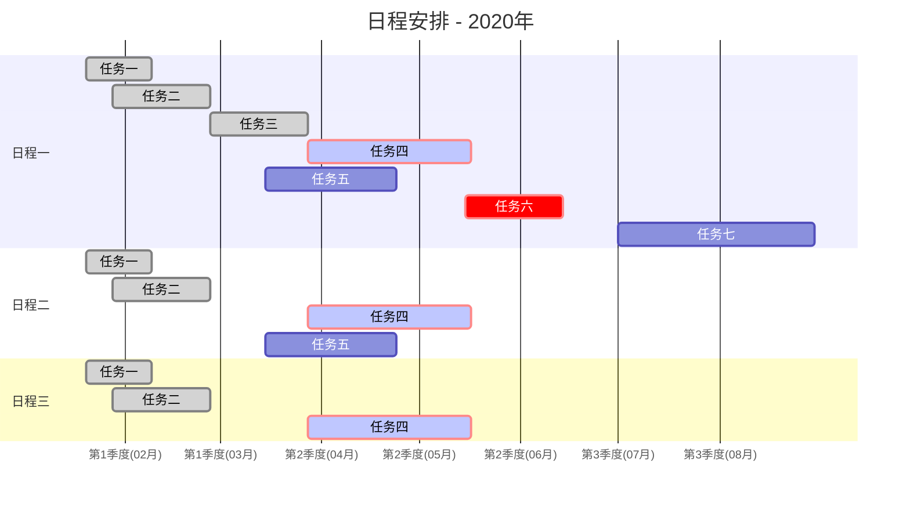
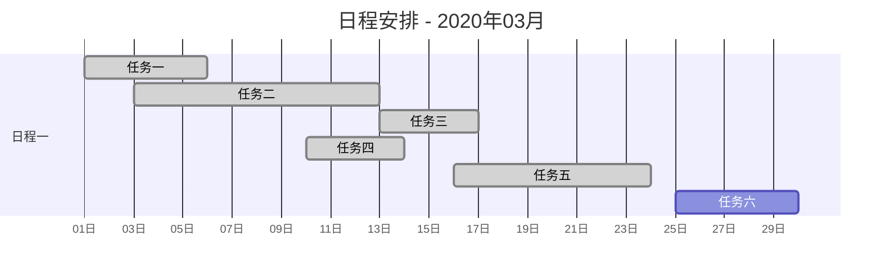

日程规划模板
=================

**2020年（年份）**
> 第一季度：1~3月份
> 第二季度：4~6月份
> 第三季度：7~9月份
> 第四季度：10~12月份

***

**2020年3月(月份)**
> 01日
> 02日
> ...
> 28日
> ...

***

**2019年3月第1周（周）**  
> 周一（Monday）
> 周二（Tuesday）
> 周三（Wednesday）
> 周四（Thursday）
> 周五（Friday）
> 周六（Saturday）
> 周日（Sunday）

```mermaid
gantt
    dateFormat DD
    axisFormat %a
    
    title 日程安排 - 2020年03月第1周
    section 日程一
    任务一    :done,            des1,  02,              1d
    任务二    :done,            des2,  02,              2d
    任务三    :crit, done,      des3,  after des2 des1, 3d
    任务四    :done,            des4,  02,              6d
```

***

**2019年3月15日（天）**  
> 01:00
> 02:00
> ...
> 23:00
> 24:00

```mermaid
gantt
    dateFormat HH:mm
    axisFormat %H:%M
    
    title 日程安排 - 2020年03月15日
    section 日程一
    任务一    :done,            des1,  01:20,           40m
    任务二    :done,            des2,  03:50,           1h
    任务三    :crit, done,      des3,  after des2 des1, 8h
    任务四    :done,            des4,  after des3,      1h
    任务五    :done,            des5,  12:00,           6h
    任务六    :                 des6,  after des5,      6h
```

***

# 季度

季度，指把一年平均分成四份（指春夏秋冬四季）。人们俗称的“季度”，就是把一年平均分成四份，按照春、夏、秋、冬的顺序。

一年可以分为四个**季度**，每个季度历时 3 个月。

第一季度：1 月 ~ 3 月
第二季度：4 月 ~ 6 月
第三季度：7 月 ~ 9 月
第四季度：10 月 ~ 12 月

而实际上严格的划分应该为：（按照中国的纬度）

第一季度：3 ~ 5 月（春季）
第二季度：6 ~ 8 月（夏季）
第三季度：9 ~ 11 月（秋季）
第四季度：12 ~ 2 月（冬季）